<h1 align="center">Hi, I'm iNezXuS</h1>

  I build practical tools for Linux, Python automation, media workflows, and desktop utilities.

  
  
  

---

### What I'm Building

- **Task Cave**: a modern dark-themed Linux task and performance manager.
- CLI-first utilities for media workflows and system automation.
- Small, focused apps that make daily desktop work faster and cleaner.

### Current Focus

- Python desktop apps with Tkinter and `psutil`
- Linux system telemetry, process management, and hardware sensors
- Reliable command-line tooling with clean user experience

### Featured Project

  

### GitHub Snapshot

  
  

---

  Clean tools. Useful interfaces. Less noise.

