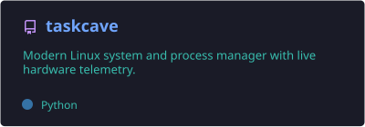
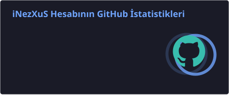
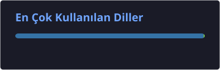

<h1 align="center">Hi, I'm <code>iNezXuS</code></h1>

  I build practical, local-first tools for Linux desktops: system utilities, Python automation, media workflows, and AI-assisted tooling.

  
  
  
  

## What I work on

- Linux desktop apps and system observability
- Reliable Python and shell automation
- Local-first AI, agent, and media workflows
- Focused tools with clear interfaces and minimal noise

## Featured project

**[Task Cave](https://github.com/iNezXuS/taskcave)** is a dark-themed Linux system and process manager with live CPU, memory, disk, network, temperature, and optional NVIDIA GPU telemetry.

## GitHub snapshot

  
  

---

<i>Useful tools. Clean interfaces. Local control.</i>

